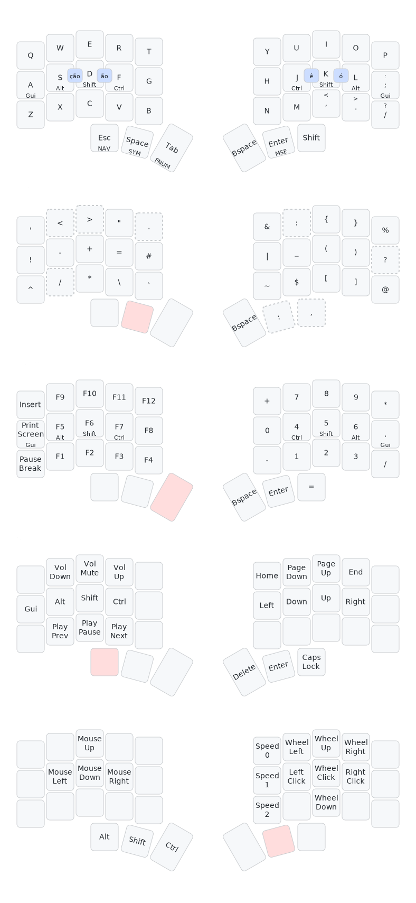

# Custom Keyboard

This repository includes my keyboard layout of my custom 3w6 keyboard.

The 3w6 is a low profile, split ortholinear keyboard with 36 keys. Each half has 3x5 vertically staggered keys and 3 thumb keys.

## Keymaps Layout

## Bootloader

Enter the bootloader in 3 ways:
- *Bootmagic reset*: Hold down the key at (0,0) in the matrix (usually the top left key or Escape) and plug in the keyboard
- *Physical reset button*: Press and hold the button on the front of the PCB when plugging in.
- *Keycode in layout*: Press the key mapped to QK_BOOT if it is available

## References

This version is distinct from keyboards/3w6 and is exclusive to [keycapsss.com](https://keycapsss.com).
- PCB and case design: by [@weteor](https://github.com/weteor/3W6)
- Hardware Supported:  on board [rp2040](https://www.raspberrypi.com/products/rp2040/) microcontrollers port by [@0xCB](https://0xcb.dev/).
- Firmware: [QMK Firmware](https://qmk.fm/)
