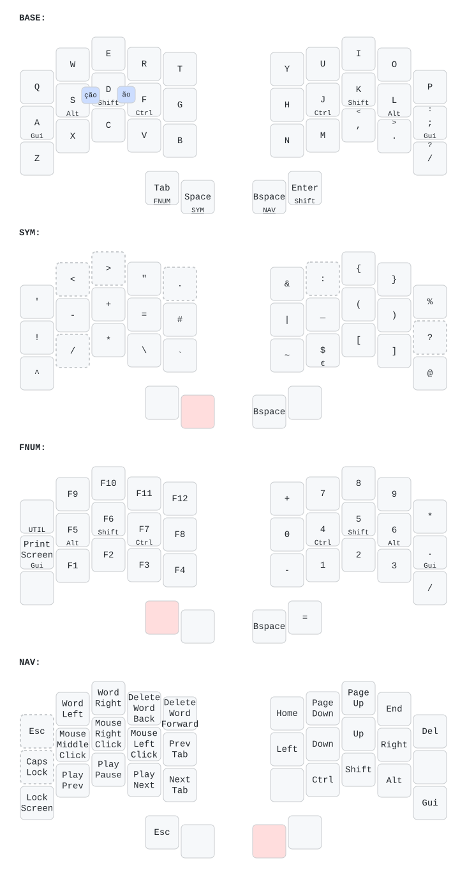

# Halcyon Ferris

My personal keymap for the splitkb Halcyon Ferris.



## Hardware

- Keyboard: `splitkb/halcyon/ferris/rev1`
- Left half: encoder
- Right half: Cirque trackpad

## Setup

Set the splitkb userspace as the QMK overlay:

```
qmk config user.overlay_dir=$HOME/qmk_userspace_splitkb
```

Symlink this keymap into the splitkb userspace:

```
ln -s $HOME/qmk-keymaps/ferris $HOME/qmk_userspace_splitkb/keyboards/splitkb/halcyon/ferris/keymaps/artur
```

Apply my splitkb userspace changes:

```
cd $HOME/qmk_userspace_splitkb
git apply $HOME/qmk-keymaps/ferris/splitkb-userspace.patch
```

## Build

This directory contains a small `Makefile` for building both halves, flash them separately.

- left half: encoder firmware
- right half: trackpad firmware
